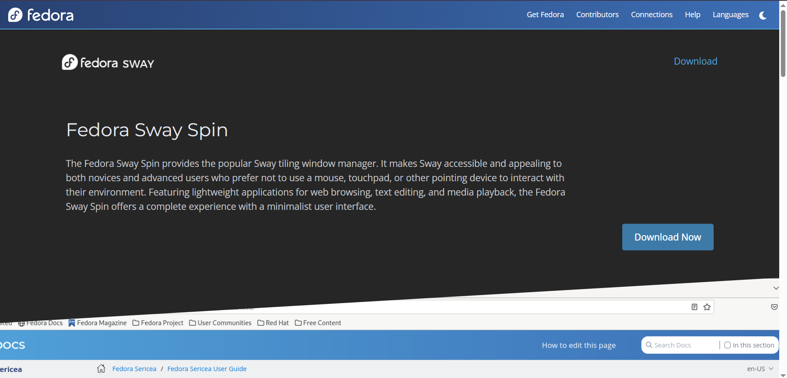
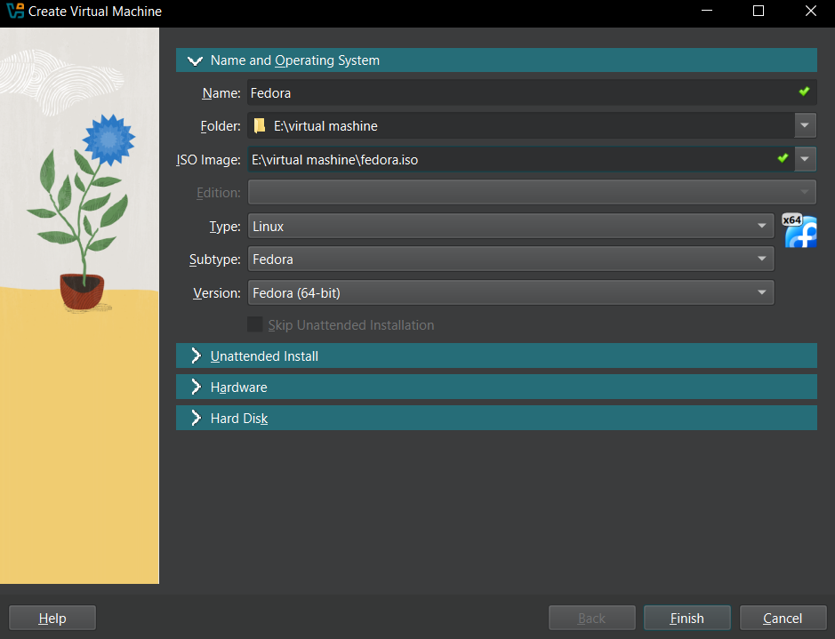
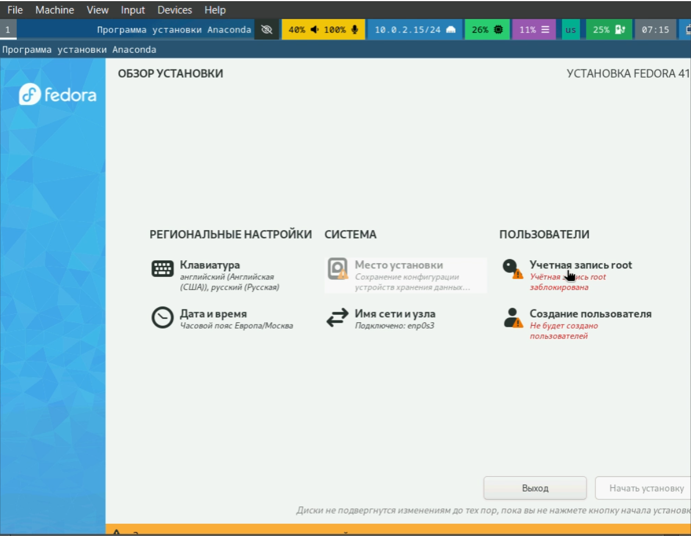

# Установка Linux Fedora на виртуальную машину
## Выполнил: Мохамед Муса
## Группа: 1032248286

---

## Цель работы
- Изучить процесс установки операционной системы Linux Fedora на виртуальную машину
- Освоить базовые команды терминала
- Познакомиться с файловой системой Linux

---

## Этап 1: Подготовка
1. Загрузка образа Fedora с официального сайта
2. Установка VirtualBox


---

## Этап 2: Создание виртуальной машины
- Создание новой ВМ в VirtualBox
- Настройка параметров:
  - Память: минимум 2 ГБ
  - Жесткий диск: 60 ГБ
  - Видеопамять: 128 МБ


---

## Этап 3: Установка Fedora
1. Запуск ВМ и загрузка с ISO-образа
2. Выбор языка установки
3. Настройка разделов диска
4. Создание пользователя


---

## Полезные команды
### Обновление системы
```bash
sudo dnf -y update
sudo dnf -y group install development-tools
```

### Установка доп. программ
```bash
sudo dnf -y install tmux mc
sudo dnf -y install kitty
```

---

## Файловая система Linux
- **ext4** - основная ФС Linux
- **NTFS** - совместимость с Windows
- **FAT32** - универсальная совместимость

Просмотр монтированных ФС:
```bash
df -h
mount
```

---

## Управление процессами
Поиск процесса:
```bash
ps aux | grep имя_процесса
```

Завершение процесса:
```bash
kill PID
kill -9 PID
```

---

## Заключение
- Установлена система Fedora
- Настроена рабочая среда
- Изучены базовые команды
- Освоены принципы работы с ФС

---

## Спасибо за внимание!
### Вопросы?