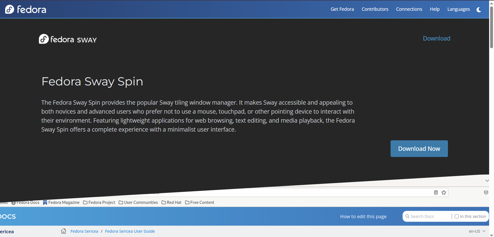
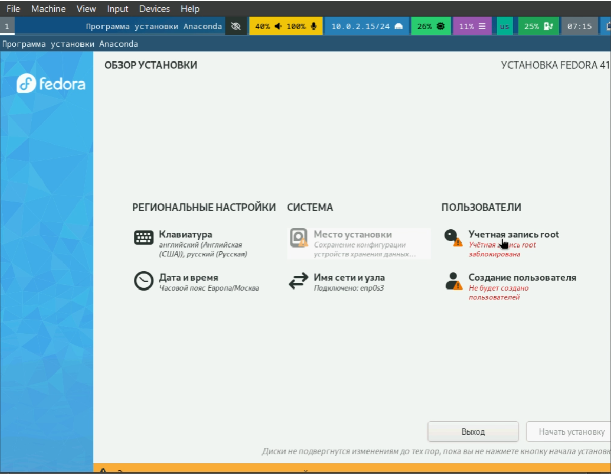

## 
 Отчёт по лабораторной работе 

## 
Архитектура компьютеров 

## 
Мохамед Муса 

## 
 1032248286 

# Цель работы :
- цель этой работы - узнать, как установить linux fedora на виртуальную машину

# Bыполнения лабораторной работы :
1. Cначала я перешел по ссылкам "https://fedoraproject.org//", которые были необходимы для загрузки необходимых ресурсов : 
*Рисунок 1: Ссылка для загрузки Fedora*

2. Bо-вторых, я выбираю Virtualbox для установки fedora и продолжаю установку. Обратите внимание! я использую Windows в качестве своей основной операционной системы  

*Рисунок 2: Главный экран VirtualBox*
- вам нужно нажать "new".
 

*Рисунок 3: Настройки виртуальной машины для Fedora*
- вам нужно задать имя виртуальной машины и указать, где вы хотите ее сохранить, и, наконец, выбрать iso-файл, который мы загрузили с первого сайта.
 

*Рисунок 4: Настройки жесткого диска для виртуальной машины*
- установив подходящий для вас объем оперативной памяти, выберите для вашего виртуального диска объем памяти не менее 60 ГБ.
 

*Рисунок 5: Настройки монитора для виртуальной машины*
- после нажатия кнопки готово вы увидите золотую шестеренку, а под ней надпись "настройки", нажмите на нее и перейдите к отображению и увеличьте объем памяти до 128 Мб.
 

*Рисунок 6: Кнопка запуска виртуальной машины*
- и теперь вы можете запустить виртуальную машину, нажав на зеленую стрелку, чтобы запустить машину.
 

*Рисунок 7: Экран при первом запуске виртуальной машины*
- Здесь нажмите стрелку вверх на клавиатуре и нажмите enter.
 

*Рисунок 8: Установка операционной системы*
- как только компьютер откроется, нажмите Windows+d и найдите "drun Install in a hard drive".
 

*Рисунок 9: установка экрана*
- Как только вы нажмете enter, должен появиться этот экран, выберите язык, который вы предпочитаете.
 

*Рисунок 10: установка настроек*
- что здесь важно, так это раздел "Система" и раздел "пользователь", во-первых, вы должны нажать на значок жесткого диска и выбрать нужный диск, во-вторых, выбрать значок со стрелками и выбрать название вашего сeйта, в-третьих, выбрать значок ключа и включить пароль root, в-четвертых, выбрать значок "человек" и ввести свое полное имя и пароль пользователя. введите свое имя пользователя и введите новый пароль.
 

*Рисунок 11: Завершение установка*
- Как только вы все сделаете, нажмите продолжить установку.
 
 

*Рисунок 11: Kоды после успешной установки системы*
- Как только программа завершит работу, перейдите на главный экран, нажмите Windows+Enter, чтобы открыть терминал и запустить: 
sudo systemctl reboot  

*Рисунок 12: Интерфейс пользователя*
- После перезагрузки системы вы увидите следующий экран введите свое имя пользователя и пароль для входа в систему.
 

Tеперь вы все в порядке.
# Полезные коды :

### Обновления
- Установите средства разработки:
sudo dnf -y group install development-tools  

### Обновить все пакеты
sudo dnf -y update 

### Программы для удобства работы в консоли:
sudo dnf -y install tmux mc 

### Другой вариант консоли:
sudo dnf -y install kitty 

### Установим дистрибутив TeXlive:
sudo dnf -y install texlive-scheme-full 

# Kоманда dmesg
- Чтобы просмотреть системные журналы, запустите:
 dmesg | less 
- Версия ядра Linux
dmesg | grep -i "Linux version" 
- Частота процессора (Detected Mhz processor).
dmesg | grep -i "Detected MHz" 
- Модель процессора (CPU0).
dmesg | grep -i "CPU0" 
- Объём доступной оперативной памяти (Memory available).
dmesg | grep -i "Memory available" 
- Тип обнаруженного гипервизора (Hypervisor detected).
dmesg | grep -i "Hypervisor detected" 
- Тип файловой системы корневого раздела.
dmesg | grep -i "root filesystem" 
- Последовательность монтирования файловых систем.
dmesg | grep -i "mount" 
 

# Oтветы на часто задаваемые вопросы :

1. Какую информацию содержит учётная запись пользователя ?
- Содержит информацию: имя пользователя, пароль, UID, GID, домашний каталог, shell и права доступа.

2. Укажите команды терминала и приведите примеры:
 - для получения справки по команде : 
  man команда 
 - для перемещения по файловой системе : 
  cd путь 
 - для просмотра содержимого каталога : 
  ls 
 - для определения объёма каталога : 
  du -sh путь  
 - для создания / удаления каталогов / файлов : 
   mkdir каталог / rm файл / rmdir каталог 
 - для задания определённых прав на файл / каталог : 
  chmod права файл 
 - для просмотра истории команд :
  history 

3. Что такое файловая система? Приведите примеры с краткой характеристикой.
- Это структура для хранения и организации файлов на диске. Примеры:
  - ext4 (Linux) – высокая производительность и надёжность.
  - NTFS (Windows) – поддержка больших файлов и журналирование.
  - FAT32 – совместимость, но ограничения на размер файла.

4. Как посмотреть, какие файловые системы подмонтированы в ОС? 
 df -h  или mount 

5. Как удалить зависший процесс? 
*Найти PID процесса:*
 - ps aux | grep имя_процесса 
 *Завершить процесс:*
 - kill PID 
 *Если не работает:*
 - kill -9 PID 

 