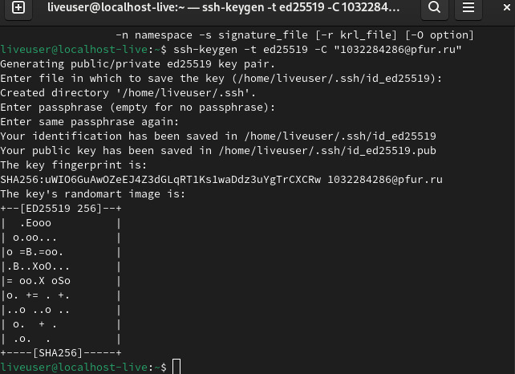
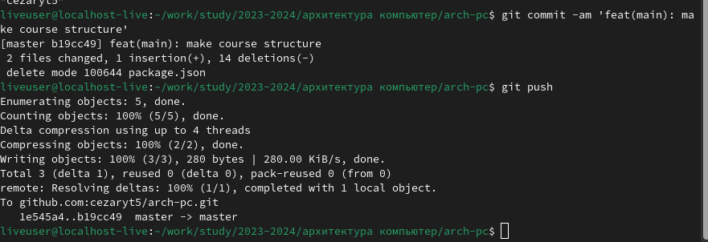

---
## Front matter
title: "Шаблон отчёта по лабораторной работе 03"
subtitle: "архитектура компьютерa"
author: "Мохамед Муса"

## Generic otions
lang: ru-RU
toc-title: "Содержание"
## Bibliography
bibliography: bib/cite.bib
csl: pandoc/csl/gost-r-7-0-5-2008-numeric.csl

## Pdf output format
toc: true # Table of contents
toc-depth: 2
lof: true # List of figures
lot: true # List of tables
fontsize: 12pt
linestretch: 1.5
papersize: a4
documentclass: scrreprt
## I18n polyglossia
polyglossia-lang:
  name: russian
  options:
	- spelling=modern
	- babelshorthands=true
polyglossia-otherlangs:
  name: english
## I18n babel
babel-lang: russian
babel-otherlangs: english
## Fonts
mainfont: IBM Plex Serif
romanfont: IBM Plex Serif
sansfont: IBM Plex Sans
monofont: IBM Plex Mono
mathfont: STIX Two Math
mainfontoptions: Ligatures=Common,Ligatures=TeX,Scale=0.94
romanfontoptions: Ligatures=Common,Ligatures=TeX,Scale=0.94
sansfontoptions: Ligatures=Common,Ligatures=TeX,Scale=MatchLowercase,Scale=0.94
monofontoptions: Scale=MatchLowercase,Scale=0.94,FakeStretch=0.9
mathfontoptions:
## Biblatex
biblatex: true
biblio-style: "gost-numeric"
biblatexoptions:
  - parentracker=true
  - backend=biber
  - hyperref=auto
  - language=auto
  - autolang=other*
  - citestyle=gost-numeric
## Pandoc-crossref LaTeX customization
figureTitle: "Рис."
tableTitle: "Таблица"
listingTitle: "Листинг"
lofTitle: "Список иллюстраций"
lotTitle: "Список таблиц"
lolTitle: "Листинги"
## Misc options
indent: true
header-includes:
  - \usepackage{indentfirst}
  - \usepackage{float} # keep figures where there are in the text
  - \floatplacement{figure}{H} # keep figures where there are in the text
---

#  3.1 Цель работы

цель этой лабораторной работы - дать нам возможность использовать markdown language и проинформировать нас обо всех командах, которые позволят нам записывать файлы на этом языке.

#  3.3 Выполнение лабораторной работы

- после перехода на arch-pc и обновления с помощью "git pull" я использовал команду "make" для проверки существующих файлов, я использовал "make clean" для удаления лишних файлов и, наконец, я использовал команду "gedit" для редактирования report.md :

- и после этого я отредактировал файл и добавил фотографии

#  3.4 выполнения заданий для самостоятельной работы:

-   после регистрации в моей учетной записи на github и подготовки моей среды я начал с подготовки настроек в моем терминале :

- и после подготовки среды я создал и скопировал свой ssh-ключ :

- и добавьте его в мой аккаунт на github :

- после этого я зашел в указанный репозиторий, использовал его в качестве шаблона и клонировал в свой каталог с помощью своего терминала :

-  и после этого я выбрал каталог arch-pc в качестве папки курса и, используя команду "git commit", я смог загрузить все файлы курса в каталог и удалить файлы jason :

# 3.5 выполнения заданий для самостоятельной работы lab02 :

- сначала я скопировал отчет lab01 и поместил его в нужный файл, а после этого я внес отчет lab 02 в файл отчета и отправил все файлы на GitHub :

# 3.6 Выводы

я научился редактировать и создавать файлы markdown

