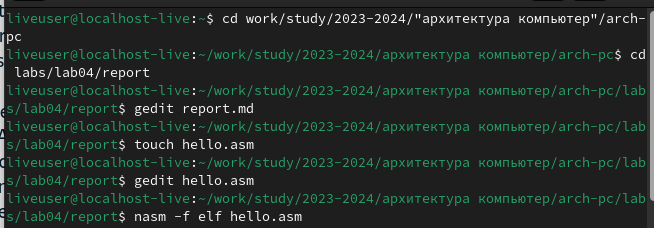
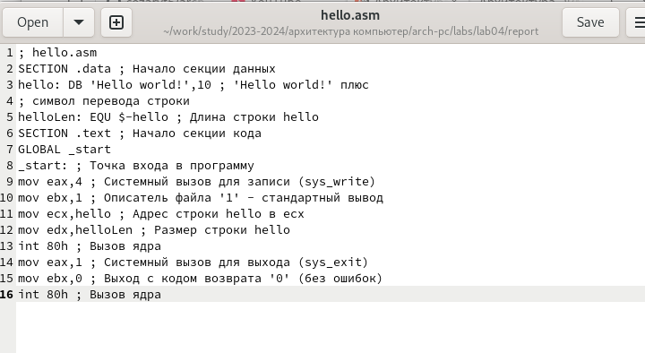
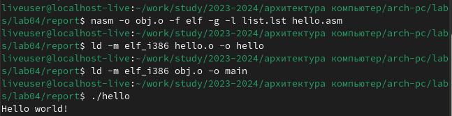
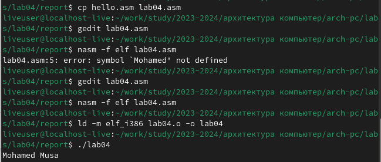
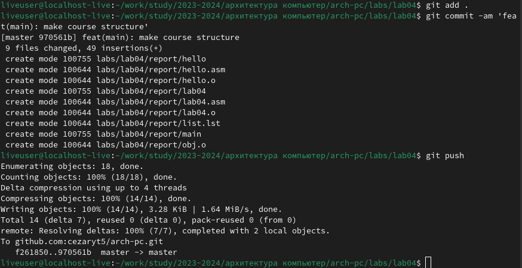

---
## Front matter
title: "Шаблон отчёта по лабораторной работе"
subtitle: "архитектура компьютерa"
author: "Мохамед Муса"

## Generic otions
lang: ru-RU
toc-title: "Содержание"

## Bibliography
bibliography: bib/cite.bib
csl: pandoc/csl/gost-r-7-0-5-2008-numeric.csl

## Pdf output format
toc: true # Table of contents
toc-depth: 2
lof: true # List of figures
lot: true # List of tables
fontsize: 12pt
linestretch: 1.5
papersize: a4
documentclass: scrreprt
## I18n polyglossia
polyglossia-lang:
  name: russian
  options:
	- spelling=modern
	- babelshorthands=true
polyglossia-otherlangs:
  name: english
## I18n babel
babel-lang: russian
babel-otherlangs: english
## Fonts
mainfont: IBM Plex Serif
romanfont: IBM Plex Serif
sansfont: IBM Plex Sans
monofont: IBM Plex Mono
mathfont: STIX Two Math
mainfontoptions: Ligatures=Common,Ligatures=TeX,Scale=0.94
romanfontoptions: Ligatures=Common,Ligatures=TeX,Scale=0.94
sansfontoptions: Ligatures=Common,Ligatures=TeX,Scale=MatchLowercase,Scale=0.94
monofontoptions: Scale=MatchLowercase,Scale=0.94,FakeStretch=0.9
mathfontoptions:
## Biblatex
biblatex: true
biblio-style: "gost-numeric"
biblatexoptions:
  - parentracker=true
  - backend=biber
  - hyperref=auto
  - language=auto
  - autolang=other*
  - citestyle=gost-numeric
## Pandoc-crossref LaTeX customization
figureTitle: "Рис."
tableTitle: "Таблица"
listingTitle: "Листинг"
lofTitle: "Список иллюстраций"
lotTitle: "Список таблиц"
lolTitle: "Листинги"
## Misc options
indent: true
header-includes:
  - \usepackage{indentfirst}
  - \usepackage{float} # keep figures where there are in the text
  - \floatplacement{figure}{H} # keep figures where there are in the text
---

# Цель работы

цель этой лабораторной работы - попрактиковаться в структуре языка программирования ассемблер, создать нашу первую программу и напечатать "! Hello World "

# Bыполнения лабораторной работы
- сначала я создал файл с именем hello.asm, после чего отредактировал его, записал ассемблерный код внутри файла и перевел файл из файла сборки в объектный файл

- я также преобразовал файл hello.o в исполняемый файл и выполнил код, после чего получил сообщение "! Hello World"

# Bыполнения заданий для самостоятельной работы:

- Сначала я скопировал файл hello.asm, отредактировал его и дал ему новое имя "lab 04.asm", а сообщение hello world заменил на мое имя Мохамед Муса, после чего преобразовал файл "lab04.asm" в объектный файл, а затем в загружаемую программу и запустил еe

- и, наконец, я загрузил все файлы в свой репозиторий :

# Выводы

мы переходим к созданию ассемблерных файлов и пишем в них ассемблерный код, а также используем команду nasm для изменения типа файлов.

# Список литературы{.unnumbered}

::: {#refs}
:::
