---
## Front matter
title: "Шаблон отчёта по лабораторной работе"
subtitle: "архитектура компьютерa"
author: "мохамед Муса"

## Generic otions
lang: ru-RU
toc-title: "Содержание"

## Bibliography
bibliography: bib/cite.bib
csl: pandoc/csl/gost-r-7-0-5-2008-numeric.csl

## Pdf output format
toc: true # Table of contents
toc-depth: 2
lof: true # List of figures
lot: true # List of tables
fontsize: 12pt
linestretch: 1.5
papersize: a4
documentclass: scrreprt
## I18n polyglossia
polyglossia-lang:
  name: russian
  options:
	- spelling=modern
	- babelshorthands=true
polyglossia-otherlangs:
  name: english
## I18n babel
babel-lang: russian
babel-otherlangs: english
## Fonts
mainfont: IBM Plex Serif
romanfont: IBM Plex Serif
sansfont: IBM Plex Sans
monofont: IBM Plex Mono
mathfont: STIX Two Math
mainfontoptions: Ligatures=Common,Ligatures=TeX,Scale=0.94
romanfontoptions: Ligatures=Common,Ligatures=TeX,Scale=0.94
sansfontoptions: Ligatures=Common,Ligatures=TeX,Scale=MatchLowercase,Scale=0.94
monofontoptions: Scale=MatchLowercase,Scale=0.94,FakeStretch=0.9
mathfontoptions:
## Biblatex
biblatex: true
biblio-style: "gost-numeric"
biblatexoptions:
  - parentracker=true
  - backend=biber
  - hyperref=auto
  - language=auto
  - autolang=other*
  - citestyle=gost-numeric
## Pandoc-crossref LaTeX customization
figureTitle: "Рис."
tableTitle: "Таблица"
listingTitle: "Листинг"
lofTitle: "Список иллюстраций"
lotTitle: "Список таблиц"
lolTitle: "Листинги"
## Misc options
indent: true
header-includes:
  - \usepackage{indentfirst}
  - \usepackage{float} # keep figures where there are in the text
  - \floatplacement{figure}{H} # keep figures where there are in the text
---

# Цель работы

цель этой лабораторной работы - попрактиковаться в структуре программирования на ассемблере и углубиться в создание небольших программ, которые принимают сообщения от различных пользователей и распечатывают их обратно

# выполнения лабораторной работы :
- Сначала, используя команду mc, я перешел в папку arch-pc и создал папку lab05, в этой папке я использовал команду touch, чтобы создать файл lab5-1.asm :
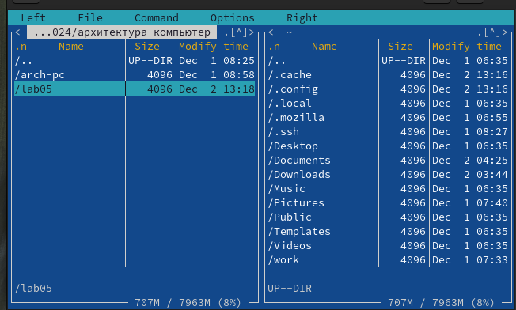{#fig:001 width=70%}

- и отредактировал файл lab-1.asm и написал в нем код
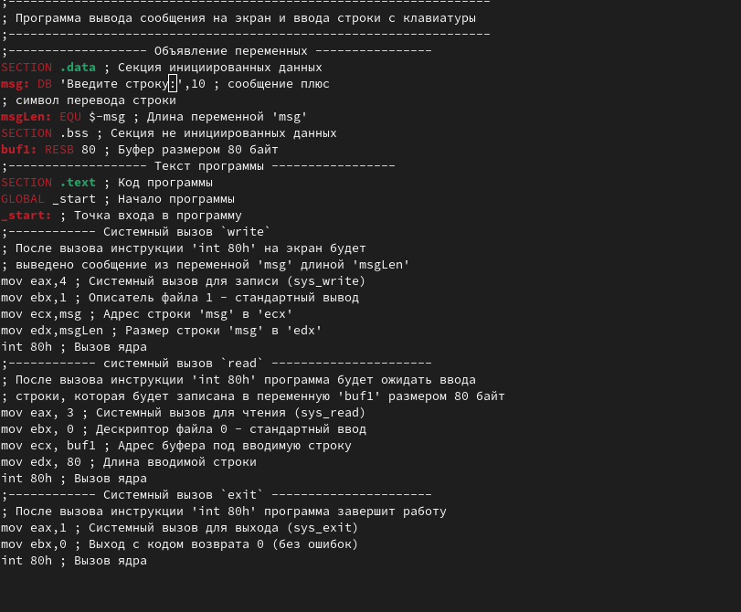{#fig:001 width=70%}

- Я преобразовал файл сборки в объект и в приложение, чтобы я мог выполнять его содержимое:
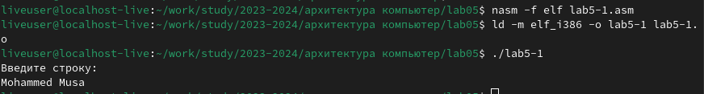{#fig:001 width=70%}

- Я скачал файл in_out из TUNIC и перенес его в нужный файл, также скопировал файл lab5-1.asm и создал новый файл с именем lab5-2.asm и отредактировал его содержимое:
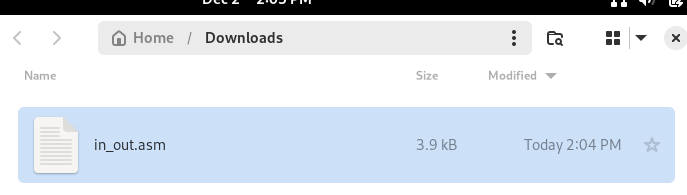{#fig:001 width=70%}
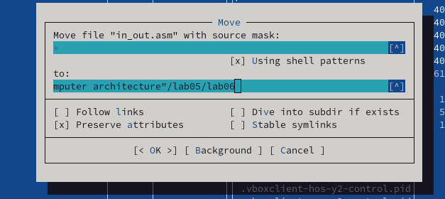{#fig:001 width=70%}

- наконец, я преобразовал файл lab5-2.asm в объектный и исполняемый файл и запустил его :
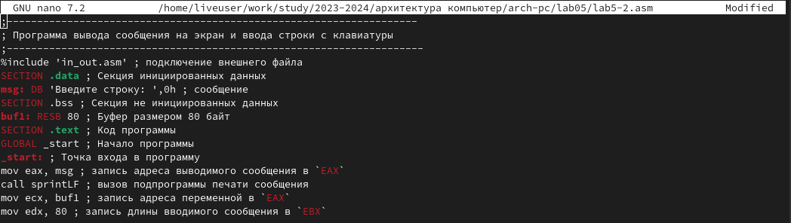{#fig:001 width=70%}
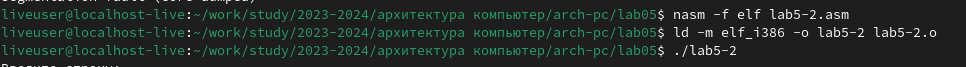{#fig:001 width=70%}

# Выполнение заданий для самостоятельной работы :

- Сначала я создал файл lab5-3 и написал код, чтобы он выполнил первую задачу :
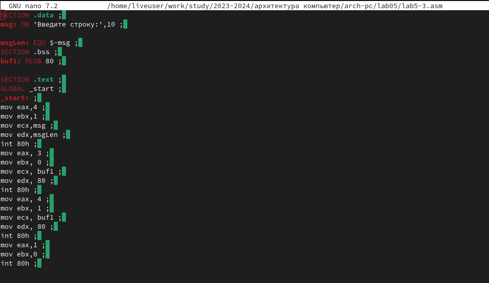{#fig:001 width=70%}

- и я преобразовал файл и запустил его :
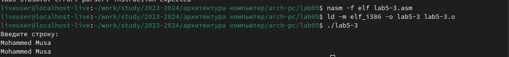{#fig:001 width=70%}

- я сделал то же самое с lab-4.asm. я отредактировал код из lab-2.asm, преобразовал его и запустил :
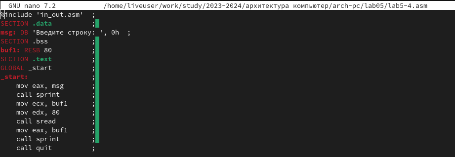{#fig:001 width=70%}
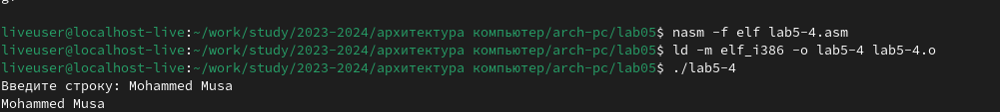{#fig:001 width=70%}

# Выводы

в заключение сегодня мы узнали, как перемещаться по файлам и папкам и редактировать их с помощью mc command, а также узнали еще больше интересного о сборке.

# Список литературы{.unnumbered}

::: {#refs}
:::
