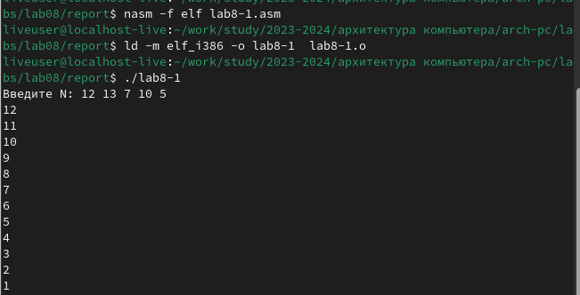
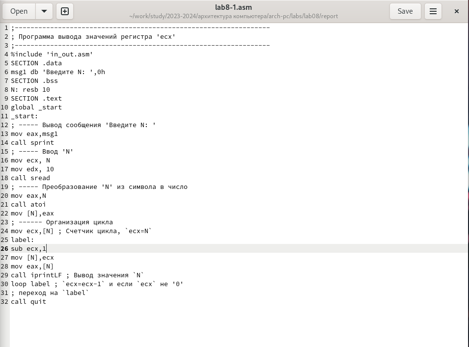
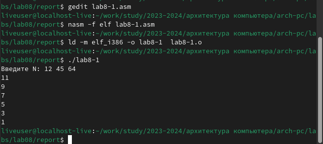
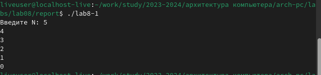
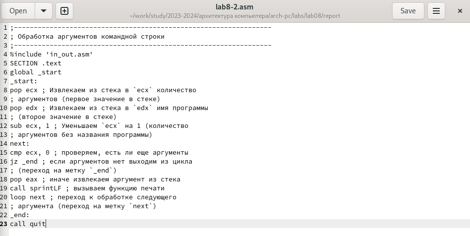
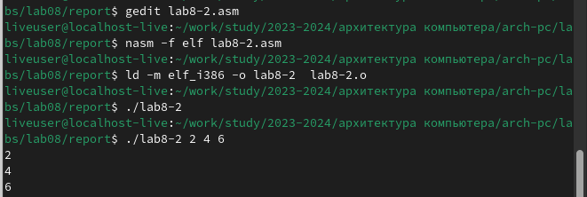
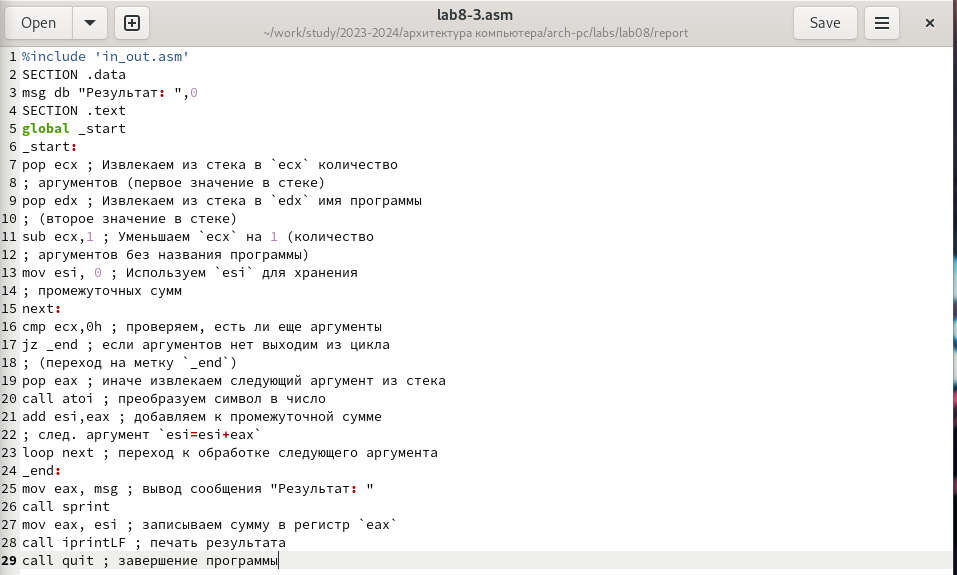
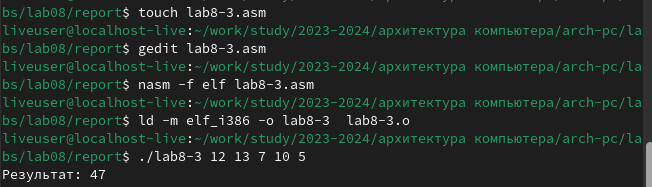
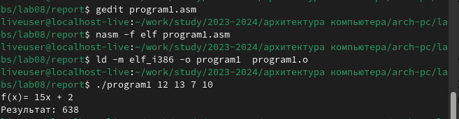
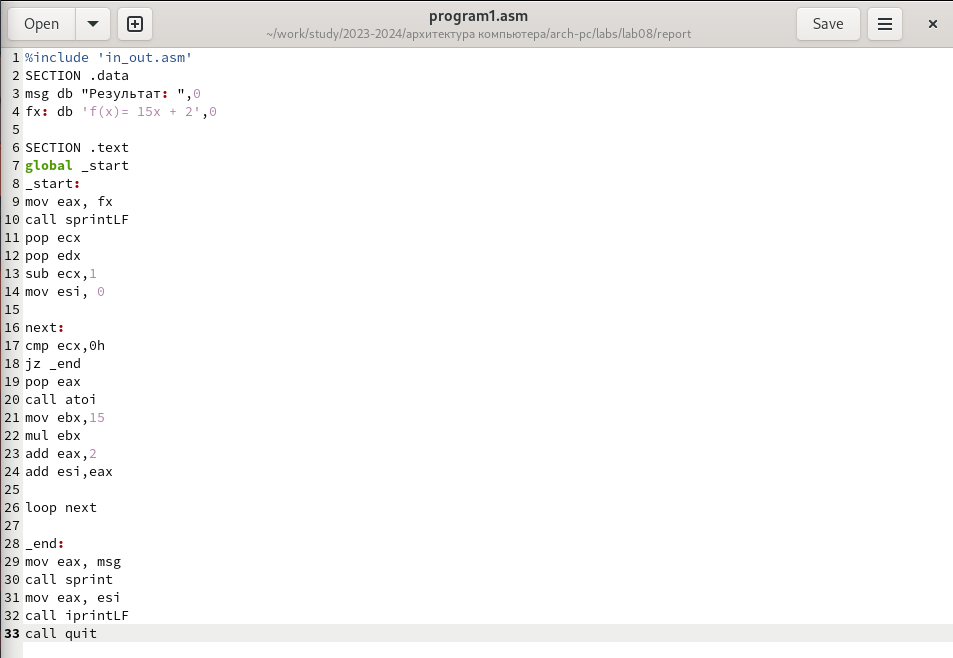

---
## Front matter
title: "Шаблон отчёта по лабораторной работе"
subtitle: "архитектура компьютерa"
author: "мохамед Муса"

## Generic otions
lang: ru-RU
toc-title: "Содержание"

## Bibliography
bibliography: bib/cite.bib
csl: pandoc/csl/gost-r-7-0-5-2008-numeric.csl

## Pdf output format
toc: true # Table of contents
toc-depth: 2
lof: true # List of figures
lot: true # List of tables
fontsize: 12pt
linestretch: 1.5
papersize: a4
documentclass: scrreprt
## I18n polyglossia
polyglossia-lang:
  name: russian
  options:
	- spelling=modern
	- babelshorthands=true
polyglossia-otherlangs:
  name: english
## I18n babel
babel-lang: russian
babel-otherlangs: english
## Fonts
mainfont: PT Serif
romanfont: PT Serif
sansfont: PT Sans
monofont: PT Mono
mainfontoptions: Ligatures=TeX
romanfontoptions: Ligatures=TeX
sansfontoptions: Ligatures=TeX,Scale=MatchLowercase
monofontoptions: Scale=MatchLowercase,Scale=0.9
## Biblatex
biblatex: true
biblio-style: "gost-numeric"
biblatexoptions:
  - parentracker=true
  - backend=biber
  - hyperref=auto
  - language=auto
  - autolang=other*
  - citestyle=gost-numeric
## Pandoc-crossref LaTeX customization
figureTitle: "Рис."
tableTitle: "Таблица"
listingTitle: "Листинг"
lofTitle: "Список иллюстраций"
lotTitle: "Список таблиц"
lolTitle: "Листинги"
## Misc options
indent: true
header-includes:
  - \usepackage{indentfirst}
  - \usepackage{float} # keep figures where there are in the text
  - \floatplacement{figure}{H} # keep figures where there are in the text
---
# Цель
Цель этой работы - углубиться в изучение языка ассемблера, и мы будем больше практиковаться в том, как создавать программы, способные выполнять уравнения

# выполнения лабораторной работы
- Сначала я создал файл  lab8-1.asm, скопировал код из pdf и запустил его :

- И я внес необходимые изменения из pdf-файл в lab8-1.asm и запустил его снова :

- Я также запустил файл lab8-2.asm и отредактировал его в соответствии с инструкцией в формате pdf :
{#fig:001 width=70%}

- В-третьих, И я также создал файл lab8-3.cm, написал его код и предоставил необходимые аргументы для запуска кода :

# Bыполнения заданий для самостоятельной работы:
- Сначала я создал программу в соответствии с инструкцией в формате pdf, выбрал функцию из таблицы вариантов и запустил код :

# Выводы
В этой работе мы больше практиковались в написании математических выражений с помощью ассемблерного кода
