---
## Front matter
title: "Шаблон отчёта по лабораторной работе"
subtitle: "архитектура компьютерa"
author: "мохамед Муса"

## Generic otions
lang: ru-RU
toc-title: "Содержание"

## Bibliography
bibliography: bib/cite.bib
csl: pandoc/csl/gost-r-7-0-5-2008-numeric.csl

## Pdf output format
toc: true # Table of contents
toc-depth: 2
lof: true # List of figures
lot: true # List of tables
fontsize: 12pt
linestretch: 1.5
papersize: a4
documentclass: scrreprt
## I18n polyglossia
polyglossia-lang:
  name: russian
  options:
polyglossia-otherlangs:
  name: english
## I18n babel
babel-lang: russian
babel-otherlangs: english
## Fonts
mainfont: IBM Plex Serif
romanfont: IBM Plex Serif
sansfont: IBM Plex Sans
monofont: IBM Plex Mono
mathfont: STIX Two Math
mainfontoptions: Ligatures=Common,Ligatures=TeX,Scale=0.94
romanfontoptions: Ligatures=Common,Ligatures=TeX,Scale=0.94
sansfontoptions: Ligatures=Common,Ligatures=TeX,Scale=MatchLowercase,Scale=0.94
monofontoptions: Scale=MatchLowercase,Scale=0.94,FakeStretch=0.9
mathfontoptions:
## Biblatex
biblatex: true
biblio-style: "gost-numeric"
biblatexoptions:
  - parentracker=true
  - backend=biber
  - hyperref=auto
  - language=auto
  - autolang=other*
  - citestyle=gost-numeric
## Pandoc-crossref LaTeX customization
figureTitle: "Рис."
tableTitle: "Таблица"
listingTitle: "Листинг"
lofTitle: "Список иллюстраций"
lotTitle: "Список таблиц"
lolTitle: "Листинги"
## Misc options
indent: true
header-includes:
  - \usepackage{indentfirst}
  - \usepackage{float} # keep figures where there are in the text
  - \floatplacement{figure}{H} # keep figures where there are in the text
---
 # 
Шаблон отчёта по лабораторной работе 

## 
архитектура компьютерa

### 
 мохамед Муса

#  Цель работы 
Цель этой работы - попрактиковаться в языке ассемблера и научиться отлаживать asm-файлы с помощью команды **gdb**.

# выполнения лабораторной работы
- Сначала я создал файл  lab9-1.asm, скопировал код из pdf и запустил его :
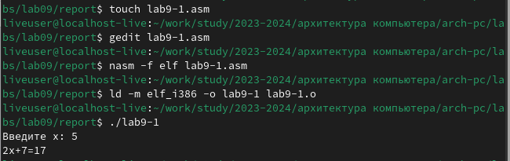
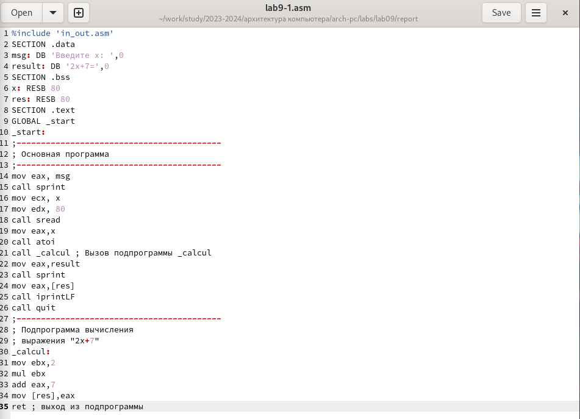

- И я внес необходимые изменения из pdf-файл в lab9-1.asm и запустил его снова :
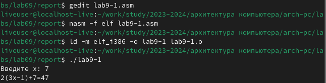
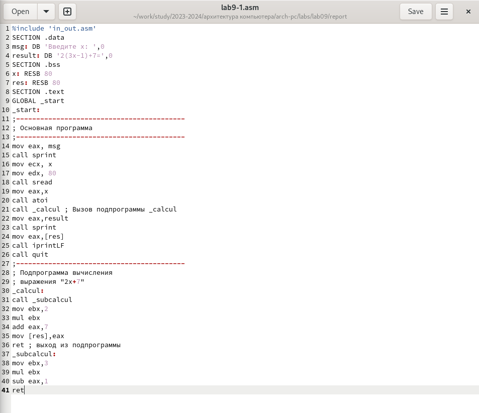

- Я создал файл lab9-2.asm и скопировал код из pdf, после чего преобразовал файл из .asm в .сначала я использовал команду **nasm**, чтобы дать мне возможность использовать команду gdb и запустить код в отладчике, а также просмотреть дисассимилированный код с помощью команды **disassemble _ start**,И переключился на отображение команд с Intel’овским синтаксисом, введя команду **set disassembly-flavor intel**:

- И я использовал команды **layout asm**и **layout regs**, чтобы продолжить анализ кода :
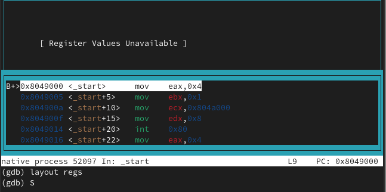

- Я установил новую точку останова с помощью команды **break** :
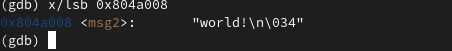

- Используя команду **set**, я изменил значение msg2 :
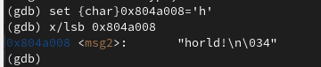

- И я использовал команду **p/""** для редактирования значений в моем коде :
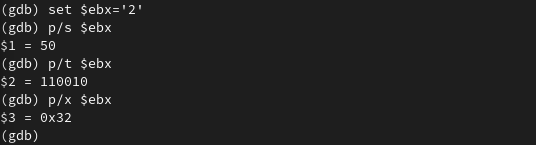

1. Команда p в GDB используется для вывода значения выражения. При этом p/s указывает формат вывода. Ниже приведены возможные форматы и их значения:

 - **p или print** — вывести значение выражения в стандартном формате.
 - **p/x** — вывести значение выражения в шестнадцатеричном формате.
 - **p/d** — вывести значение выражения в десятичном формате.
 - **p/o** — вывести значение выражения в восьмеричном формате.
 - **p/t** — вывести значение выражения в двоичном формате.
 - **p/s** — вывести значение выражения в символьном виде (если возможно).

 - Также я создал lab9-3.asm и преобразовал его в файл **.lst**, после чего использовал команду **gdb --args** для отладки файлов с аргументами :
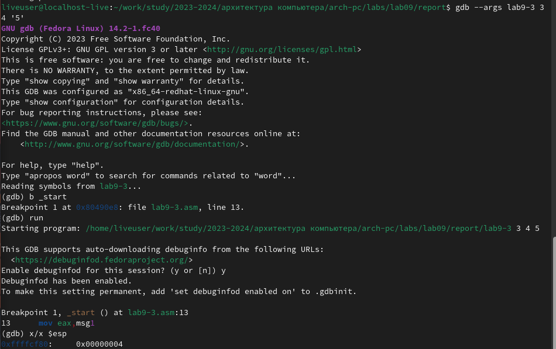

- И я также проверил адрес аргументов :
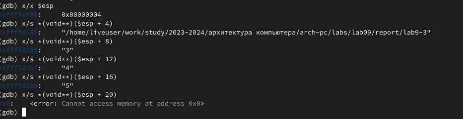

Шаг изменения адреса равен 4 **([esp+4], [esp+8], [esp+12] и т.д.)**, потому что стек хранит данные в формате 32-битных значений (4 байта). В системе x86, указатели и данные передаются через стек, который использует 4-байтовые слова для адресации.

# Bыполнения заданий для самостоятельной работы:
- сначала я написал первую программу и запустил еe :
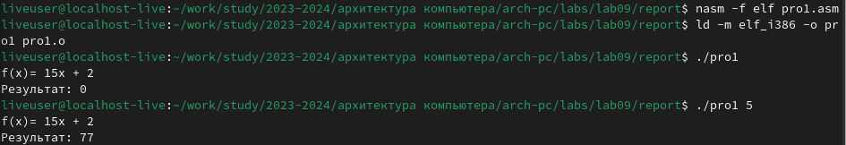
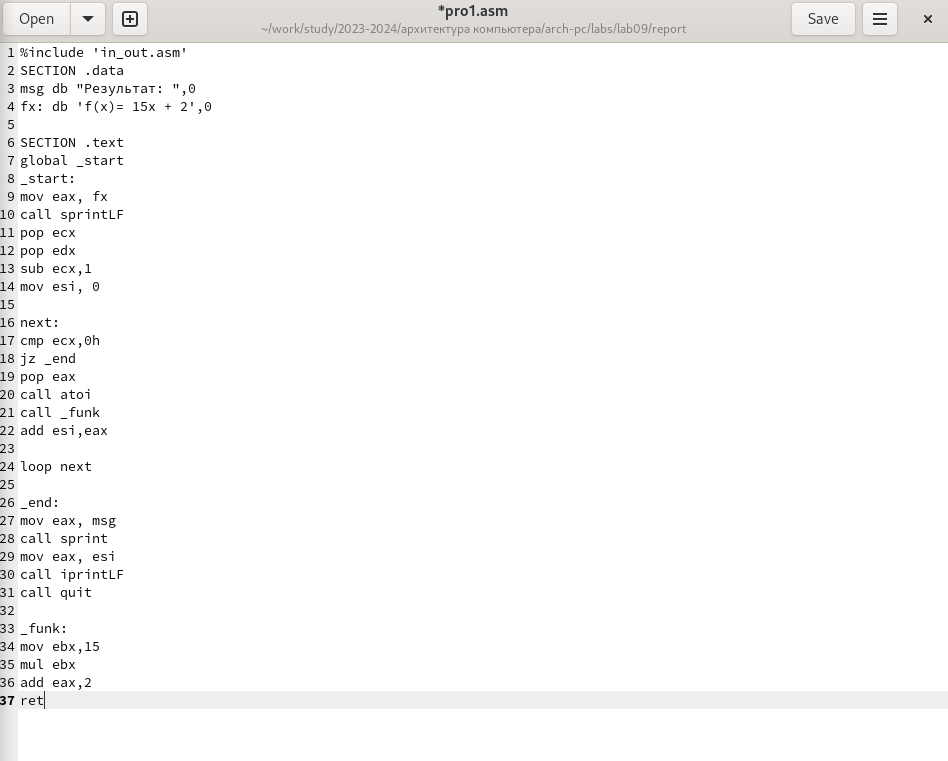

- и я написал вторую программу в соответствии с инструкциями, приведенными в pdf-файле и запустил ее:
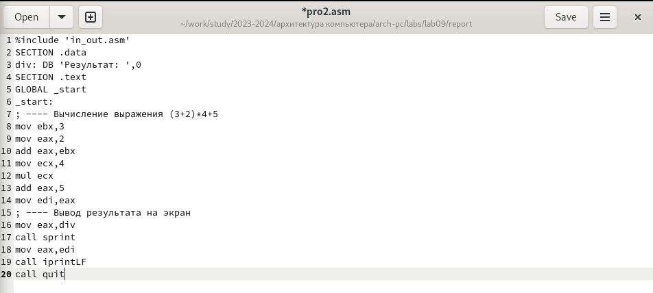

- поскольку в первой программе была допущена ошибка, я использовал команду gdb и исправил ошибку :

Ошибка была в неправильном использовании регистров и операций. Исправленная программа правильно вычисляет выражение, сохраняя промежуточные результаты и корректно использует регистры для умножения.
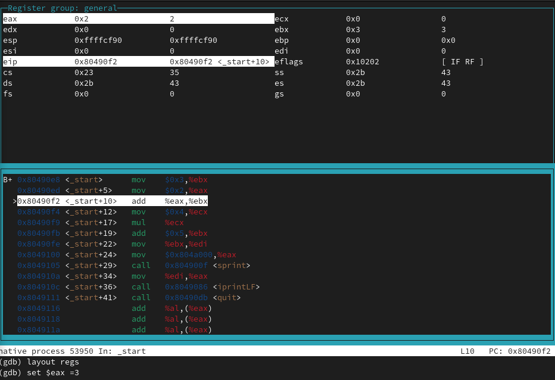

# Выводы
в этой работе мы узнали, как отлаживать и редактировать asm-файлы с помощью команды gdb
