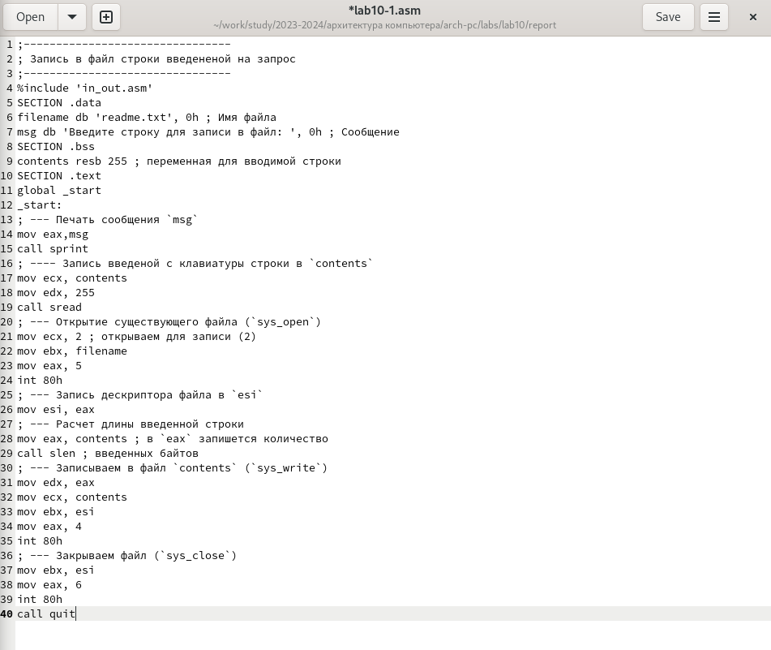
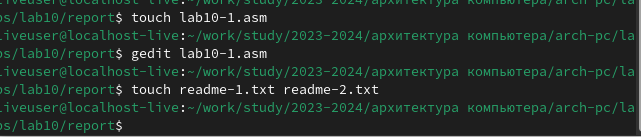
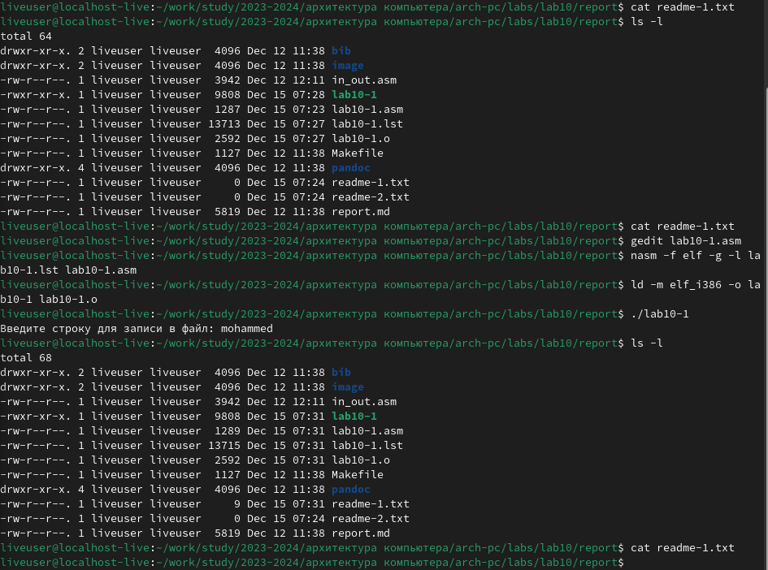
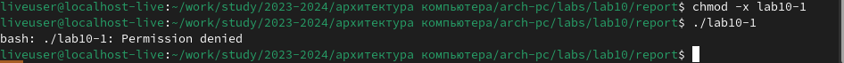
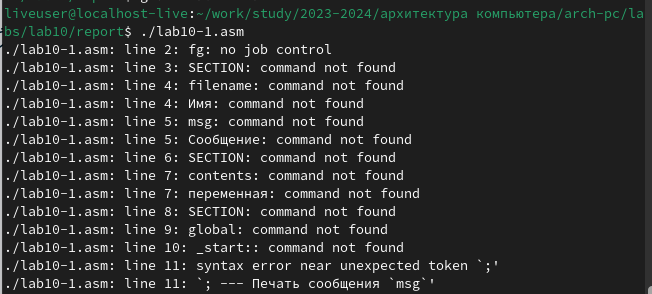
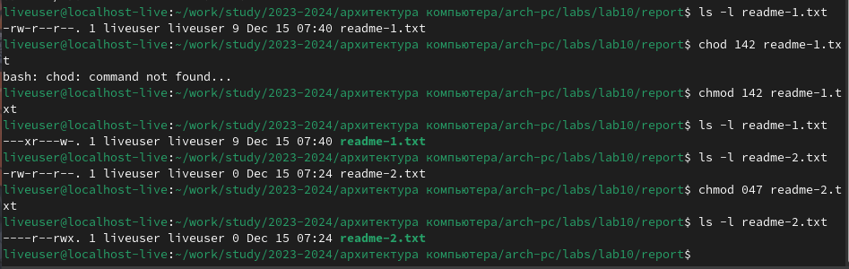
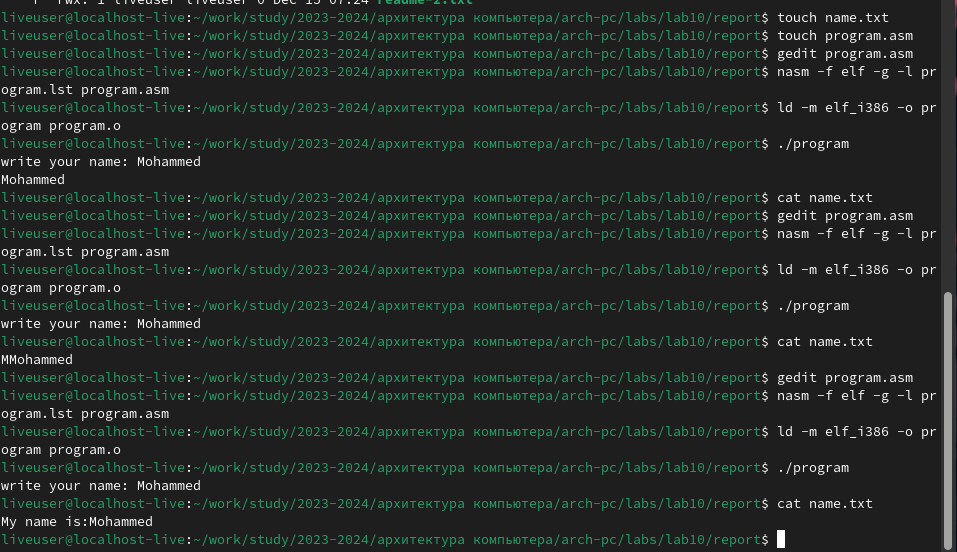
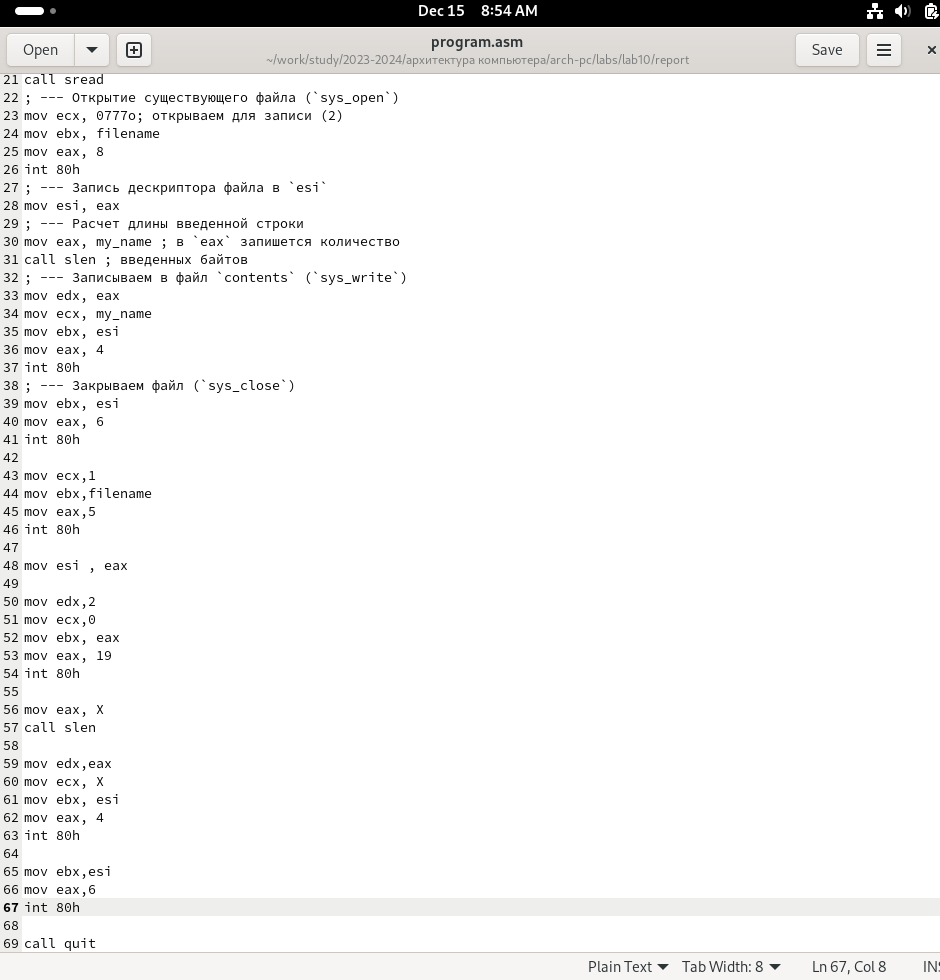

---
## Front matter
title: "Шаблон отчёта по лабораторной работе"
subtitle: "архитектура компьютерa"
author: "Mохамед Муса"

## Generic otions
lang: ru-RU
toc-title: "Содержание"

## Bibliography
bibliography: bib/cite.bib
csl: pandoc/csl/gost-r-7-0-5-2008-numeric.csl

## Pdf output format
toc: true # Table of contents
toc-depth: 2
lof: true # List of figures
lot: true # List of tables
fontsize: 12pt
linestretch: 1.5
papersize: a4
documentclass: scrreprt
## I18n polyglossia
polyglossia-lang:
  name: russian
  options:
	- spelling=modern
	- babelshorthands=true
polyglossia-otherlangs:
  name: english
## I18n babel
babel-lang: russian
babel-otherlangs: english
## Fonts
mainfont: IBM Plex Serif
romanfont: IBM Plex Serif
sansfont: IBM Plex Sans
monofont: IBM Plex Mono
mathfont: STIX Two Math
mainfontoptions: Ligatures=Common,Ligatures=TeX,Scale=0.94
romanfontoptions: Ligatures=Common,Ligatures=TeX,Scale=0.94
sansfontoptions: Ligatures=Common,Ligatures=TeX,Scale=MatchLowercase,Scale=0.94
monofontoptions: Scale=MatchLowercase,Scale=0.94,FakeStretch=0.9
mathfontoptions:
## Biblatex
biblatex: true
biblio-style: "gost-numeric"
biblatexoptions:
  - parentracker=true
  - backend=biber
  - hyperref=auto
  - language=auto
  - autolang=other*
  - citestyle=gost-numeric
## Pandoc-crossref LaTeX customization
figureTitle: "Рис."
tableTitle: "Таблица"
listingTitle: "Листинг"
lofTitle: "Список иллюстраций"
lotTitle: "Список таблиц"
lolTitle: "Листинги"
## Misc options
indent: true
header-includes:
  - \usepackage{indentfirst}
  - \usepackage{float} # keep figures where there are in the text
  - \floatplacement{figure}{H} # keep figures where there are in the text
---

# Цель работы
в этой работе мы узнаем, как использовать assembly для манипулирования файлами .

# Выполнение лабораторной работы

- Сначала я создал файл lab10-1.asm, readme-1.txt и readme-2.txt скопировал код из версии 10.1 в pdf и запустил его :
{#fig:001 width=70%}
{#fig:001 width=70%}
{#fig:001 width=70%}
**Обратите внимание**, что я связал файл readme-1.txt с lab10-1.asm, чтобы использовать программу для записи в файл

- используя команду chmod, я изменил разрешение доступа к файлу lab10-1 :
{#fig:001 width=70%}

- в результате файл запустился, и терминал попытался выполнить его содержимое, но поскольку это ассемблерный код, а не исполняемая версия, возникли ошибки :
{#fig:001 width=70%}

- Кроме того, я изменил права доступа к файлам readme-1.asm, readme-2.asm с помощью команды ls и выбрал 11-й вариант для проверки результатов :
{#fig:001 width=70%}

# Задание для самостоятельной работы
1. Напишите программу работающую по следующему алгоритму:
 -  Вывод приглашения “Как Вас зовут?”.
 - ввести с клавиатуры свои фамилию и имя.
 - создать файл с именем name.txt.
 - записать в файл сообщение “Меня зовут”.
 - дописать в файл строку введенную с клавиатуры.
 - закрыть файл.
 
 - Cначала, используя команду touch, я создал все необходимые файлы и написал код в файле program.asm и выполнил его после нескольких попыток, после которых я смог добраться до кода записи :
 {#fig:001 width=70%}
 {#fig:001 width=70%}
 
# Выводы

- в этой работе мы узнали, как манипулировать файлами и повышать ценность их содержимого с помощью языка ассемблера.
